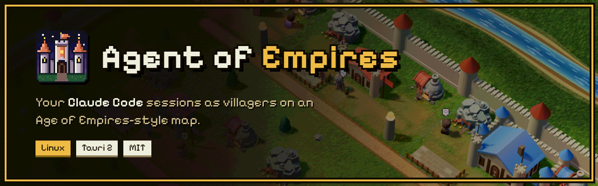
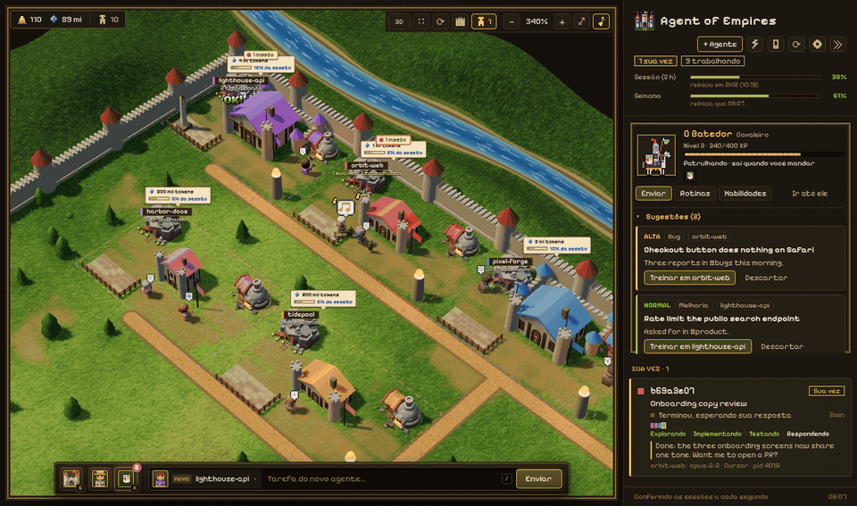
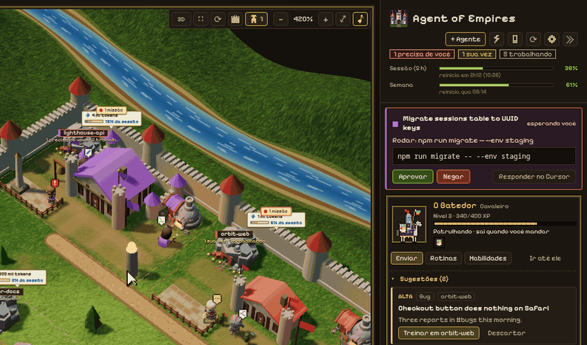
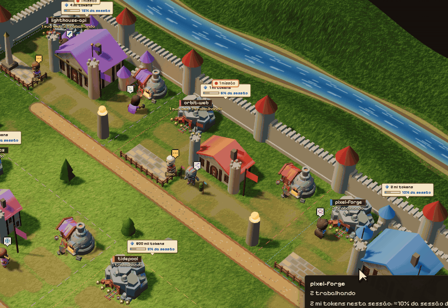
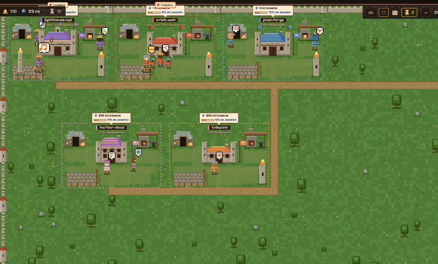
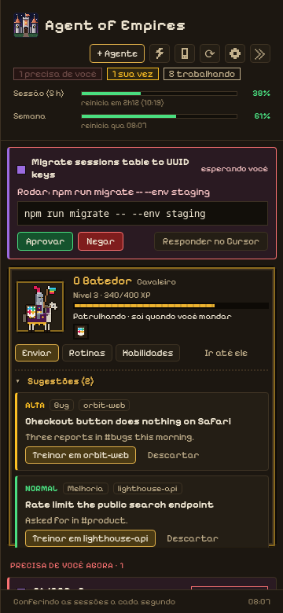

<p align="center">
  
</p>

Every repository is a base, every Claude Code session is a villager working in it, and the
villager's job on the map is what the agent is doing right now: mining gold while it reads,
hammering at the forge while it runs commands, waving at you when it is your turn. A desktop app
for Linux, built with Tauri 2.

<p align="center">
  
</p>

> The interface is in Brazilian Portuguese. A full guide to it lives in
> [docs/MANUAL.pt-BR.md](docs/MANUAL.pt-BR.md). Translations are welcome.

## What it does

- **See every session at once**: Claude Code in the terminal, in VS Code or Cursor, and SDK
  sessions, grouped by repository. What needs you comes first: a blocked approval rings the town
  bell, a finished turn puts the villager in front of the town center, waving.
- **Approve from one place**: permission prompts from any session show up in the side panel with
  the full command, with Approve and Deny. With no answer in 60 s, or with the app closed, Claude
  Code shows its own dialog as usual.
- **Start agents from the map**: click a town center (or pick a base in the bottom bar), write the
  task, and it opens in a prefilled Cursor tab by default; the app can also run `claude` itself or
  in your terminal. Select villagers and click another base to send them there, as in the game.
- **A scout that brings the work**: a knight with the Slack mark on its shield reads the Slack
  channels, Gmail search or Notion pages you equip it with, and comes back with missions for your
  bases, each with a ready task. It levels up as villagers take its missions.
- **Jump to a session**: clicking a villager brings up the editor window and tab that hosts it.
- **Grow a base**: drag the edges of its land, up to three lots each way. The new land is
  generated from the repository's name: a bailey walls in the land behind the town center (towers,
  a keep, halls), and a village of houses, barns and fields fills the rest.
- **An empire from real data**: commits are gold, lines added are wood, agent hours are food,
  tracked files are stone, and the tokens agents spent are blue crystals. Bases age up from
  Discovery to Imperial with the work done in them.
- **Three views**: top-down pixel art, pixel isometric, and 3D in the style of Age of Empires III.

## A quick tour

The captures below run the real interface on demo data: the repositories, tasks and Slack reports
are made up.

### Approve from one place

A blocked agent rings the town bell and its prompt lands in the side panel, with the full command.
Approve it there and the villager goes back to work.

<p align="center"></p>

### Train a villager

Click a town center, write the task and pick where it runs: a prefilled Cursor tab, the app
itself, or your terminal. The new villager walks into the base.

<p align="center"></p>

### Three ways to see it

Top-down pixel art, pixel isometric, and 3D. `V` switches between top-down and 3D, `Q` and `E`
turn the camera.

<p align="center"></p>

### The side panel and the scout



The side panel puts what needs you first: plan limits, open approvals, then every session with its
phase, from exploring to answering.

The scout, O Batedor, rides out to the Slack channels, Gmail searches or Notion pages you equip it
with and comes back with missions: a bug, an improvement or an idea, the base it belongs to and a
task ready to train a villager with. It only reads, and it never starts an agent by itself.

<br clear="right">

## Requirements

- **Linux** (X11 or Wayland). macOS and Windows are not supported: the app reads `/proc` and talks
  over Unix sockets.
- **[Claude Code](https://docs.claude.com/en/docs/claude-code)** (the `claude` command) and **git**.
- To build: **Rust** (stable, from [rustup.rs](https://rustup.rs)) and the WebKitGTK libraries
  Tauri builds against:

  ```bash
  # Debian / Ubuntu
  sudo apt install libwebkit2gtk-4.1-dev libayatana-appindicator3-dev librsvg2-dev build-essential
  # Fedora
  sudo dnf install webkit2gtk4.1-devel libappindicator-gtk3-devel librsvg2-devel
  # Arch
  sudo pacman -S webkit2gtk-4.1 libappindicator-gtk3 librsvg base-devel
  ```

- Optional: **Cursor** or **VS Code** (to open sessions in a tab), **curl** (plan limits),
  **pw-play**, **paplay** or **aplay** (sound), **notify-send** (desktop notifications), and on
  GNOME the [Activate Window By Title](https://extensions.gnome.org/extension/5021/activate-window-by-title/)
  extension, so a click can bring the editor window to the front.

## Install

```bash
git clone https://github.com/jvlustosa/agent-of-empires.git
cd agent-of-empires
./scripts/install.sh
```

The script builds a release binary and installs it for your user only: the binary in
`~/.local/bin`, the icons, and an "Agent of Empires" entry in your app menu. No sudo. Run it again
after a `git pull` to update; `./scripts/install.sh --uninstall` removes it.

## First run

The app opens a short setup, **Fundar o império** ("found the empire"), in four steps:

1. **Check**: Claude Code, your session history, git, editor, terminal, sound and WebGL, each with a
   one-line fix when something is missing.
2. **Repositories**: the folder the app looks for git repositories in (and one level below). It is
   suggested from where your Claude Code sessions ran, or `~/Code`.
3. **First bases**: the repositories Claude worked on most recently come checked and become bases,
   so the map does not open empty.
4. **Integrations**, each one saying what it touches: approvals in the panel, plan limits, opening
   at login, and sound. "Pular introdução" (skip) turns nothing on.

Then a list of objectives, like the game's tutorial, walks you through training a villager,
inspecting one, answering a prompt, switching the view and moving a base. Each one ticks off when
you actually do it. Press `?` for every keyboard shortcut. Settings › "Rever a introdução" opens
the setup again.

## Privacy: what it reads and writes

Everything is read locally, from Claude Code's files and from git:

| Reads | For |
|---|---|
| `~/.claude/sessions/`, `~/.claude/projects/` | live sessions, what each one is doing, titles, agent hours and tokens |
| `git log`, `git rev-list` and the `.git/index` header in your repositories | gold, wood, stone and each base's age |
| `~/.claude.json`, only `claudeAiMcpEverConnected` (the names of the connectors linked to your Claude account) | the scout's bag |
| `~/.claude/skills/*/SKILL.md` | the skills the scout can carry |
| `~/.config/dev.fontenele.agent-of-empires/scout-connectors.json`, only if you create it | connectors of your own for the scout (see the manual) |

| Writes | When |
|---|---|
| `~/.claude/settings.json` | only if you turn on approvals in the panel: it adds one `PermissionRequest` hook, keeps every other key and hook as it was, and saves the previous file as `settings.json.agent-of-empires.bak` |
| `~/.config/autostart/Agent of Empires.desktop` | only if you turn on opening at login |
| `~/.config/dev.fontenele.agent-of-empires/` | its own settings, and the scout's equipment, missions and journal (`scout.json`) |

The app's own network call is the plan limits, and only when that option is on: every minute the
app asks `api.anthropic.com` for your usage, the same request `/usage` makes in Claude Code, with
Claude Code's own OAuth token. The token is read, never changed, and goes to curl through stdin.

The scout ("O Batedor") reads Slack, Gmail, Notion, Google Drive or Google Calendar only once you equip it with them. Each round
is a `claude -p` that uses the connectors of your Claude account, with read tools only: built-in
tools off, your settings files ignored (`--restricted`), write tools denied, no transcript saved.
A mission keeps a short technical summary and the source links, never the messages, and never
starts an agent by itself.

The phone panel ("Celular", off by default) is the one thing that listens on the network. Turned
on, the app serves a small page and a JSON API on port 47380 (another free one if taken), answers
only private addresses, Tailscale (100.64/10) and localhost, and every API call needs the 256-bit
pairing code from the QR (kept in `phone.json`, mode 0600). It is plain HTTP: on a shared Wi-Fi,
use it only over Tailscale. From the phone you can approve or deny prompts, reply to any waiting agent
(one in Cursor or a terminal is stopped there and resumed in the app with your message), answer the
questions of agents the app hosts, turn "approve everything for 10 min" on or off (the map follows) and
start one in a listed repository; turning it off closes the port. To reach it away from
home, run a tunnel to that port (Cloudflare Tunnel, say) and put its https domain in the panel's
"Endereço na internet": the QR then offers an "Internet" link. A tunnel arrives from localhost, so
only the pairing code guards it: put a login in front (Cloudflare Access). "Invalidar código" cuts
every paired phone off at once, and "O código vale por" makes each code expire after 1, 7 or 30 days.

Agents started "aqui no app" run `claude` with your permissions. Pushes to `main` are blocked for
them (`git push origin main`, `HEAD:main`, `--force`). "Encerrar sessão" sends SIGTERM to a session's
`claude` process, only after two clicks.

## Configuration

| Variable | Effect |
|---|---|
| `CPO_PROJECTS_ROOT` | overrides the repositories folder chosen at first run |
| `CLAUDE_CONFIG_DIR` | where Claude Code keeps its files (default `~/.claude`) |
| `TERMINAL` | the terminal "No terminal" agents open in |

## Development

```bash
cd src-tauri
cargo run          # debug build, frontend loaded from ../src
cargo test
```

The backend is Rust in `src-tauri/src/`. The frontend is plain ES modules in `src/` with no build
step; three.js is vendored in `src/vendor/three/`, with its glTF loader in `addons/` (the bare
`'three'` import rewritten to a relative path, since the CSP rules out an inline import map).
Ready-made 3D models live in `src/models/` and load through `src/js/models.js`. Icons come from
`scripts/gen-icon.py`. Feature documentation goes in [docs/MANUAL.pt-BR.md](docs/MANUAL.pt-BR.md);
the product plan in [docs/PRD.md](docs/PRD.md).

## Limitations

- Only Claude Code is visible. Conversations on claude.ai and in the Claude desktop app are not
  written to these files.
- Transcripts reach the map 1 to 3 seconds after the agent acts.
- Opening a session in an editor tab is built for Cursor; VS Code works for focusing.

## License and credits

MIT, see [LICENSE](LICENSE). Bundled: [three.js](https://threejs.org) (MIT,
`src/vendor/three/LICENSE`), the [Pixelify Sans](https://github.com/eifetx/Pixelify-Sans) font
(SIL Open Font License, `src/fonts/OFL.txt`) and models from the
[KayKit Medieval Hexagon Pack](https://kaylousberg.itch.io/kaykit-medieval-hexagon) by
[Kay Lousberg](https://www.kaylousberg.com) (CC0, `src/models/kaykit/LICENSE.txt`), his
[KayKit Adventurers](https://kaylousberg.itch.io/kaykit-adventurers) character pack (CC0,
`src/models/kaykit-adventurers/LICENSE.txt`), the
[Fantasy Town Kit](https://kenney.nl/assets/fantasy-town-kit) by [Kenney](https://www.kenney.nl)
(CC0, `src/models/kenney/License.txt`) and the horse from the Ultimate Animated Animal Pack by
[Quaternius](https://quaternius.com) (CC0, `src/models/quaternius/License.txt`).

Agent of Empires is a fan-made tribute. It is not affiliated with or endorsed by Microsoft (Age of
Empires), Gravity (Ragnarok Online) or Anthropic. The pixel-art sprites and the music are original,
drawn and composed in code. In the 3D map, the gold mine, forge and pine trees are KayKit models,
the villagers and the riders are KayKit Adventurers characters, the scouts ride Quaternius' horse,
and the town centers' walls and gabled roofs are built from Kenney's Fantasy Town Kit pieces.
